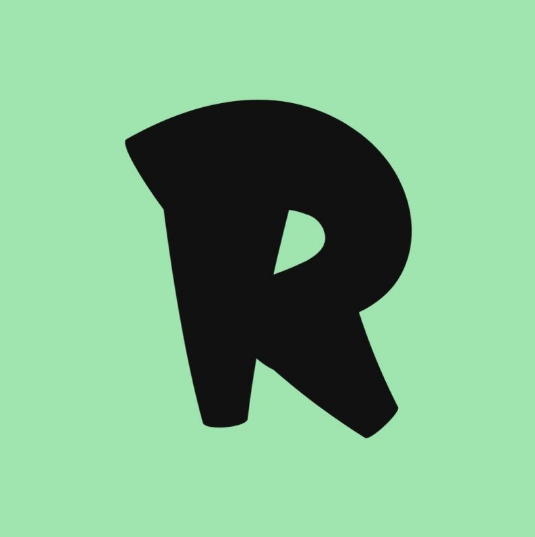

<!-- Improved compatibility of back to top link: See: https://github.com/othneildrew/Best-README-Template/pull/73 -->

<!--
*** Thanks for checking out the Best-README-Template. If you have a suggestion
*** that would make this better, please fork the repo and create a pull request
*** or simply open an issue with the tag "enhancement".
*** Don't forget to give the project a star!
*** Thanks again! Now go create something AMAZING! :D
-->

<!-- PROJECT SHIELDS -->
<!--
*** I'm using markdown "reference style" links for readability.
*** Reference links are enclosed in brackets [ ] instead of parentheses ( ).
*** See the bottom of this document for the declaration of the reference variables
*** for contributors-url, forks-url, etc. This is an optional, concise syntax you may use.
*** https://www.markdownguide.org/basic-syntax/#reference-style-links
-->
<!-- [![Contributors][contributors-shield]][contributors-url]
[![Forks][forks-shield]][forks-url]
[![Stargazers][stars-shield]][stars-url]
[![Issues][issues-shield]][issues-url]
[![MIT License][license-shield]][license-url]
[![LinkedIn][linkedin-shield]][linkedin-url] -->

<!-- PROJECT LOGO -->
 

  

  <h3 align="center">Ryanqueva.fr</h3>

  

    My personnal website 
     
    <a href="https://github.com/beloow/ryanqueva.fr/index.html"><strong>Explore the docs »</strong></a>
     
     
    <a href="https://beloow.github.io/ryanqueva.fr/">View Demo</a>
    ·
    <a href="https://github.com/beloow/ryanqueva.fr/issues">Report Bug</a>
    ·
    <a href="https://github.com/beloow/ryanqueva.fr/issues">Request Feature</a>
  

<!-- TABLE OF CONTENTS -->

  
Table des matières

  <ol>
    <li>
      <a href="#about-the-project">About The Project</a>
      <ul>
        <li><a href="#built-with">Built With</a></li>
      </ul>
    </li>
    <li><a href="#roadmap">Roadmap</a></li>
    <li><a href="#contact">Contact</a></li>
    <li><a href="#acknowledgments">Acknowledgments</a></li>
  </ol>

<!-- ABOUT THE PROJECT -->
## About The Project

Passionné par le développement web, je consacre mon temps libre à perfectionner mes compétences en HTML, CSS et PHP. Pour présenter cela j'ai decider de réaliser un site web !

Il me permet de :
* Présentation professionnelle : Un portfolio en ligne me permet de présenter mes compétences, mon travail et mon expérience de manière professionnelle. Cela peut être particulièrement utile pour la recherche d'un emploi ou pour des opportunités.
* Visibilité : Un portfolio en ligne donne une présence sur le web, ce qui peut  rendre plus visible pour les employeurs potentiels, les clients, les collaborateurs, ou même les personnes qui partagent un intérêt pour votre travail.
* Éducation et développement personnel : La création d'un portfolio en ligne me pousse à réfléchir sur mon parcours professionnel, à identifier mes forces et faiblesses, et à définir mes objectifs futurs :smile:

En résumé, un portfolio en ligne est un outil polyvalent qui peut vous aider à promouvoir votre travail, à développer votre carrière, à établir votre présence en ligne et à connecter avec un public plus large. Il est devenu essentiel dans de nombreux domaines professionnels pour montrer vos réalisations et compétences de manière efficace et professionnelle.

(<a href="#readme-top">back to top</a>)

### Built With

<!-- * [![HTML][Next.js]][Next-url]
* [![CSS][React.js]][React-url]
* [![Vue][Vue.js]][Vue-url]
* [![Angular][Angular.io]][Angular-url]
* [![Svelte][Svelte.dev]][Svelte-url]
* [![Laravel][Laravel.com]][Laravel-url] -->
* ![HTML5][html5.com]
* ![CSS3][css3.com]
* ![JavaScript][javascript.com]
* [![GitHub][github.com]][github-url]
* [![Figma][figma.com]][figma-url]
<!-- * [![Bootstrap][Bootstrap.com]][Bootstrap-url] -->

(<a href="#readme-top">back to top</a>)

<!-- ROADMAP -->
## Roadmap

- [x] Renouveler le style global
- [x] Description personnel
- [x] Presenter quelques projets
- [x] Ajouter les butons de contact pro & reseaux sociaux
- [x] Ajouter un README & Github Pages
- [x] Formulaire de contact
- [x] Ajouter un bouton "back to top"
- [ ] Errors pages

See the [open issues](https://github.com/beloow/ryanqueva.fr/issues) for a full list of proposed features (and known issues).

(<a href="#readme-top">back to top</a>)

<!-- CONTACT -->
## Contact

Ryan QUEVA - [Linkedin](https://www.linkedin.com/in/ryan-queva) - Contact@ryanqueva.fr

Project Link: [https://github.com/beloow/ryanqueva.fr](https://github.com/beloow/ryanqueva.fr)

(<a href="#readme-top">back to top</a>)

<!-- ACKNOWLEDGMENTS -->
## Acknowledgments

Use this space to list resources you find helpful and would like to give credit to. I've included a few of my favorites to kick things off!

* [Choose an Open Source License](https://choosealicense.com)
* [Img Shields](https://shields.io)
* [GitHub Pages](https://pages.github.com)
* [Font Awesome](https://fontawesome.com)
* [Font Monserrat](https://fonts.google.com/specimen/Montserrat)
* [React Icons](https://react-icons.github.io/react-icons/search)

(<a href="#readme-top">back to top</a>)

<!-- MARKDOWN LINKS & IMAGES -->
<!-- https://www.markdownguide.org/basic-syntax/#reference-style-links -->
[contributors-shield]: https://img.shields.io/github/contributors/othneildrew/Best-README-Template.svg?style=for-the-badge
[contributors-url]: https://github.com/beloow/ryanqueva.fr/contributors
[forks-shield]: https://img.shields.io/github/forks/othneildrew/Best-README-Template.svg?style=for-the-badge
[forks-url]: https://github.com/beloow/ryanqueva.fr/network/members
[stars-shield]: https://img.shields.io/github/stars/othneildrew/Best-README-Template.svg?style=for-the-badge
[stars-url]: https://github.com/othneildrew/Best-README-Template/stargazers
[issues-shield]: https://img.shields.io/github/issues/othneildrew/Best-README-Template.svg?style=for-the-badge
[issues-url]: https://github.com/othneildrew/Best-README-Template/issues
[license-shield]: https://img.shields.io/github/license/othneildrew/Best-README-Template.svg?style=for-the-badge
[license-url]: https://github.com/othneildrew/Best-README-Template/blob/master/LICENSE.txt
[linkedin-shield]: https://img.shields.io/badge/-LinkedIn-black.svg?style=for-the-badge&logo=linkedin&colorB=555
[linkedin-url]: https://www.linkedin.com/in/ryan-queva
[product-screenshot]: resources/img/icon.png
[Next.js]: https://img.shields.io/badge/next.js-000000?style=for-the-badge&logo=nextdotjs&logoColor=white
[Next-url]: https://nextjs.org/
[React.js]: https://img.shields.io/badge/React-20232A?style=for-the-badge&logo=react&logoColor=61DAFB
[React-url]: https://reactjs.org/
[Vue.js]: https://img.shields.io/badge/Vue.js-35495E?style=for-the-badge&logo=vuedotjs&logoColor=4FC08D
[Vue-url]: https://vuejs.org/
[Angular.io]: https://img.shields.io/badge/Angular-DD0031?style=for-the-badge&logo=angular&logoColor=white
[Angular-url]: https://angular.io/
[Svelte.dev]: https://img.shields.io/badge/Svelte-4A4A55?style=for-the-badge&logo=svelte&logoColor=FF3E00
[Svelte-url]: https://svelte.dev/
[Laravel.com]: https://img.shields.io/badge/Laravel-FF2D20?style=for-the-badge&logo=laravel&logoColor=white
[Laravel-url]: https://laravel.com
[Bootstrap.com]: https://img.shields.io/badge/Bootstrap-563D7C?style=for-the-badge&logo=bootstrap&logoColor=white
[Bootstrap-url]: https://getbootstrap.com
[JQuery.com]: https://img.shields.io/badge/jQuery-0769AD?style=for-the-badge&logo=jquery&logoColor=white
[JQuery-url]: https://jquery.com 
[figma.com]: https://img.shields.io/badge/figma-%23F24E1E.svg?style=for-the-badge&logo=figma&logoColor=white
[figma-url]: https://www.figma.com/
[github.com]: https://img.shields.io/badge/github-%23121011.svg?style=for-the-badge&logo=github&logoColor=white
[github-url]: https://www.github.com/
[html5.com]: https://img.shields.io/badge/html5-%23E34F26.svg?style=for-the-badge&logo=html5&logoColor=white
[css3.com]: https://img.shields.io/badge/css3-%231572B6.svg?style=for-the-badge&logo=css3&logoColor=white
[javascript.com]: https://img.shields.io/badge/javascript-%23323330.svg?style=for-the-badge&logo=javascript&logoColor=%23F7DF1E
